# 💸 Expense Tracker (Streamlit + MySQL)

A multipage expense tracking web app built with **Streamlit** and **MySQL**.  
Easily track your expenses, analyze spending patterns, and visualize data with interactive charts.

## 🚀 Features
- ✅ Add, search, and view expenses
- ✅ Interactive charts (Pie, Bar, Line)
- ✅ Expense statistics & metrics
- ✅ MySQL database backend
- ✅ Streamlit multipage UI

## 📂 Project Structure
ExpenseTracker/
├── Home.py # Main dashboard
├── Pages/
│ ├── 1_Add_Expense.py # Add expense
│ ├── 2_View_Expense.py # View expenses based on category
│ ├── 3_View_All_Expenses.py # View all expenses
| ├── 3_Charts.py # Charts
│ └── 4_Stats.py # Statistics
├── db_utils.py # Query handling
├── dbconnect.py # MySQL connection
├── requirements.txt
└── README.md

## 🛠️ Tech Stack
- **Frontend/UI:** Streamlit
- **Database:** MySQL
- **Data Analysis:** Pandas, Plotly

## 🔗 Database Setup
1. Create database:

CREATE DATABASE expense_tracker;

2. Create table:

CREATE TABLE expenses (
    id INT AUTO_INCREMENT PRIMARY KEY,
    title VARCHAR(255),
    category VARCHAR(100),
    amount DECIMAL(10,2),
    eDate DATE
);

## 🔐 Environment Variables
Create a `.env` file in the root folder:

DB_HOST=localhost
DB_USER=root
DB_PASSWORD=yourpassword
DB_NAME=dbexpense

▶️ Running Locally

pip install -r requirements.txt
streamlit run Home.py

## 📸 Screenshots

### 🏠 Home Page
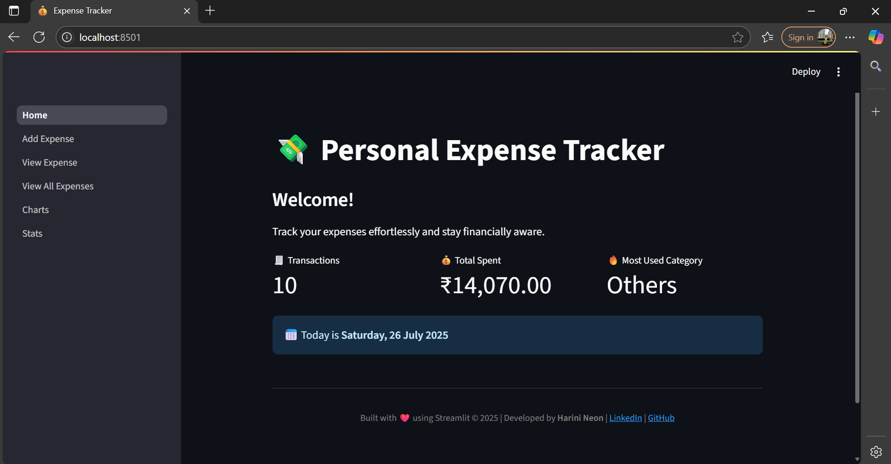

### ➕ Add Expense Page

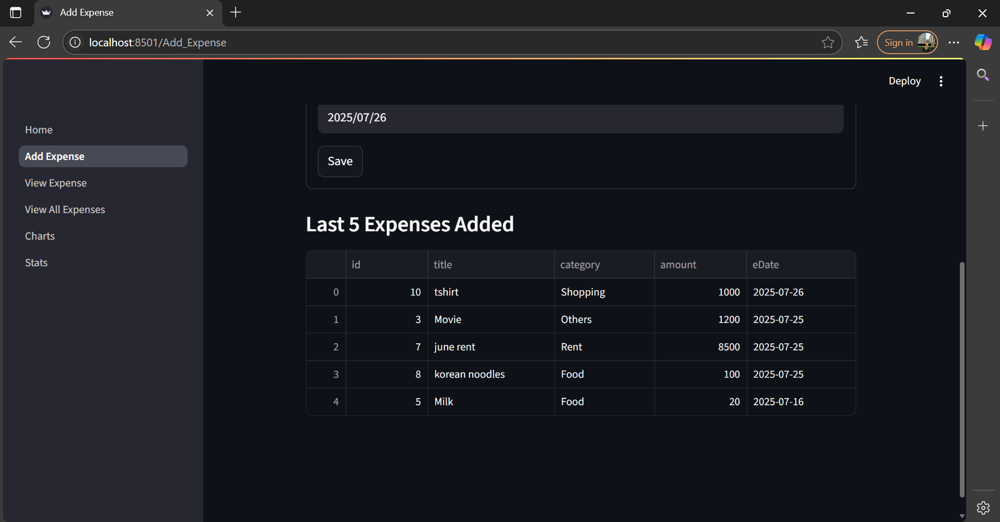

### 📂 View Expenses by category Page
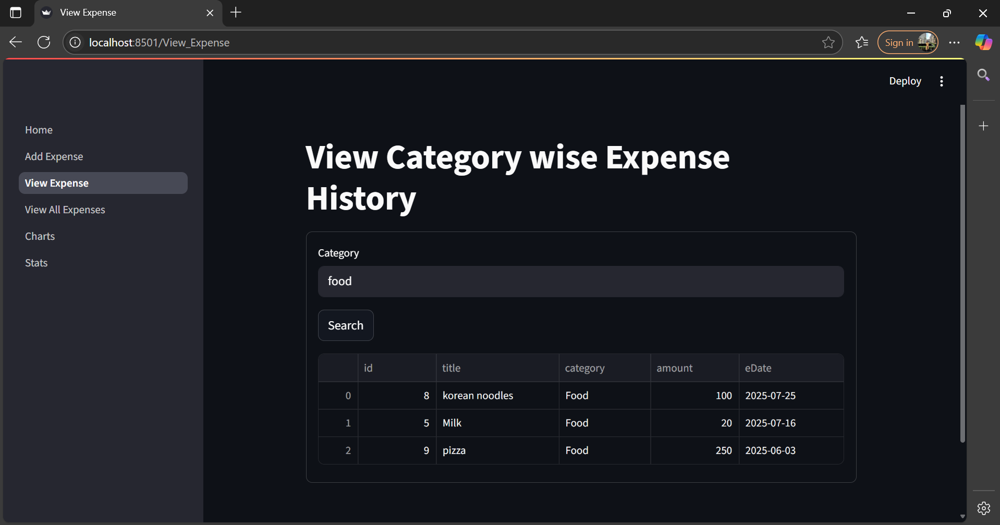

### 📂 View All Expenses Page
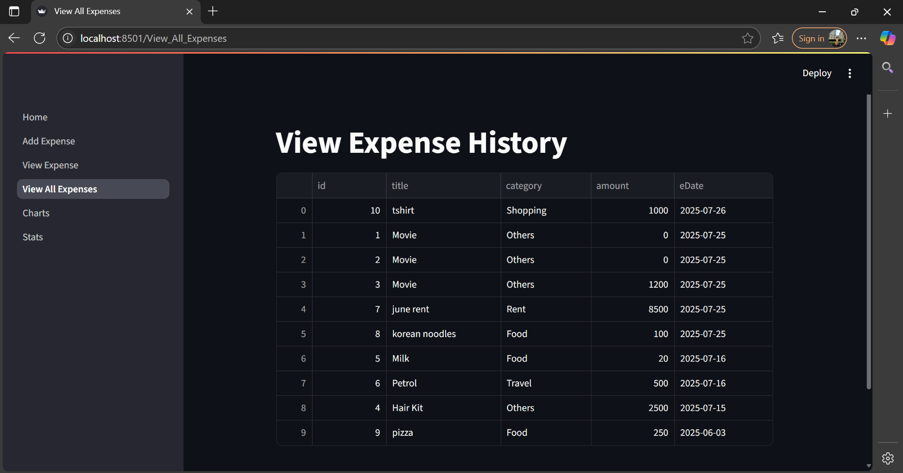

### 📊 Charts Page
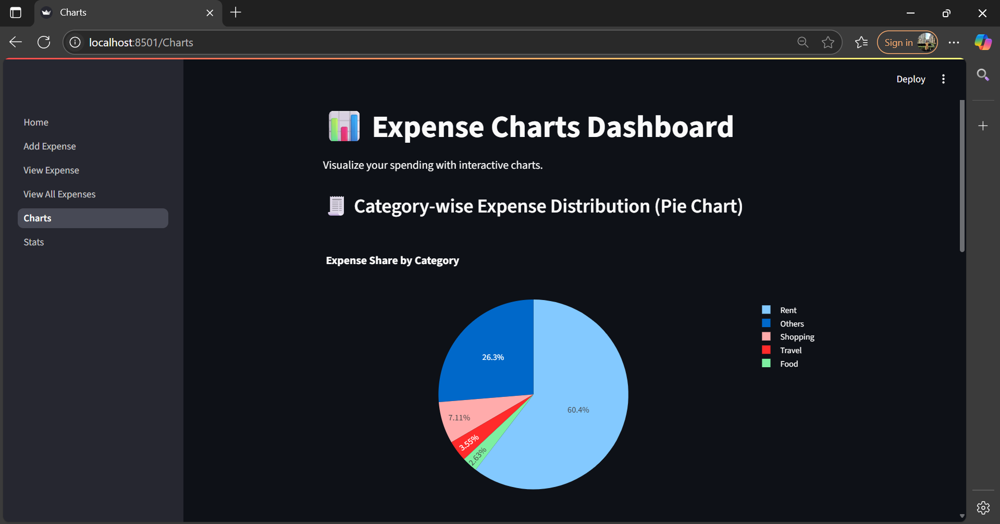
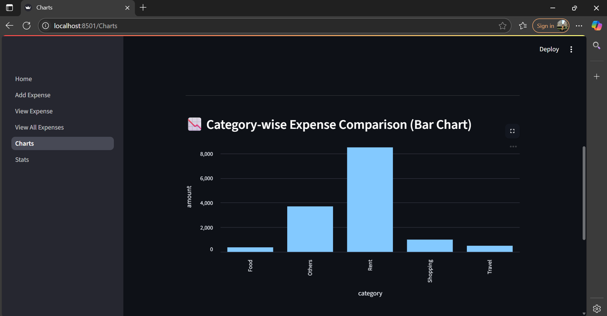
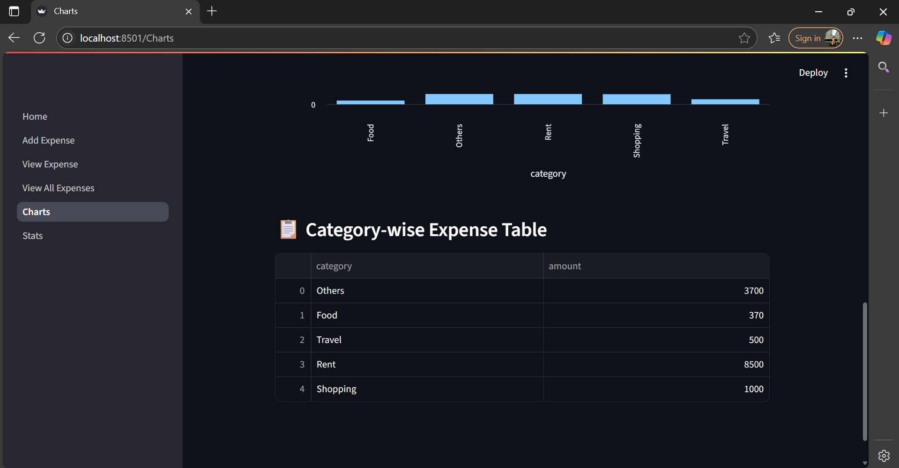

### 📈 Stats Page
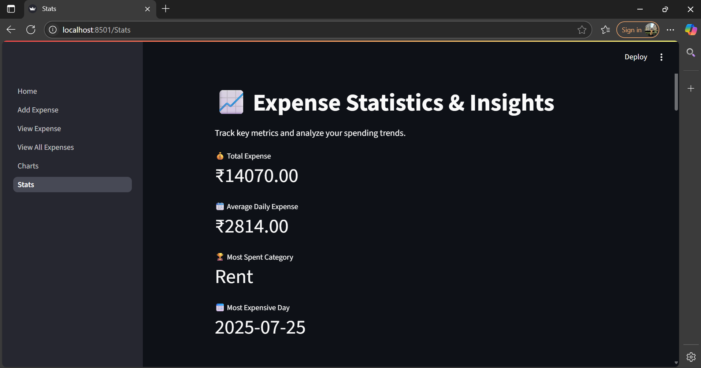
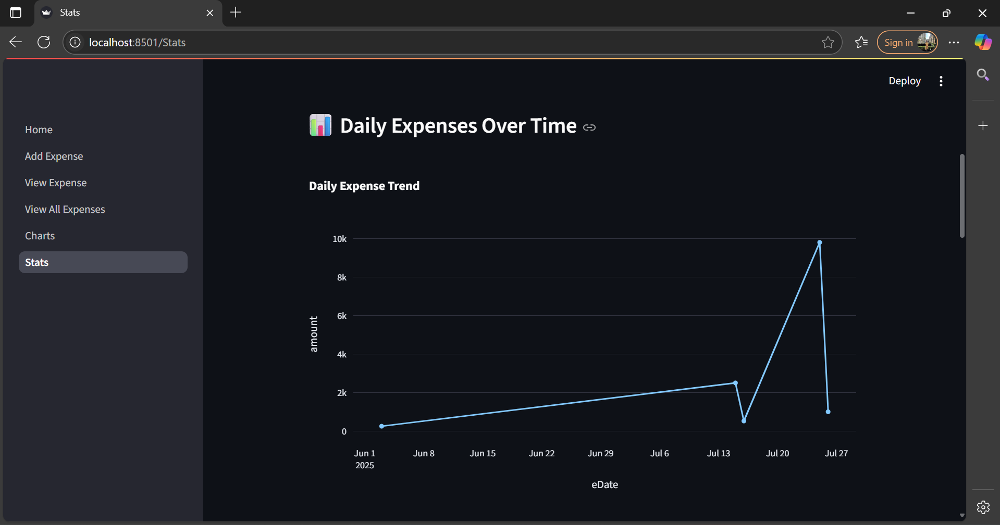

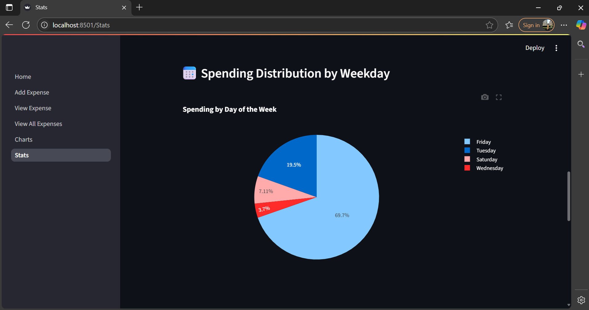
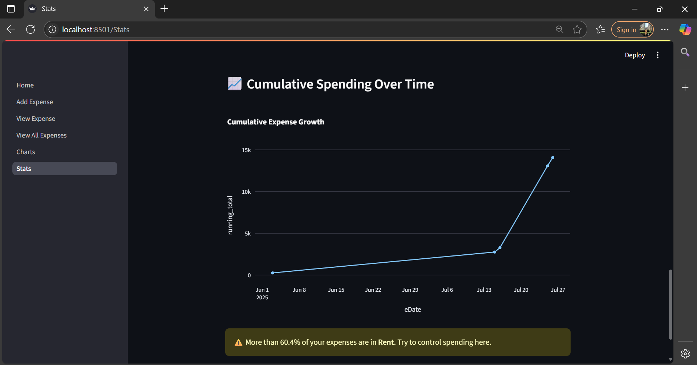

👤 Developer
Built by Harini Neon💚

🔗 [Linkedin](https://www.linkedin.com/in/shree-harini-k-m-a35a42250/)

🔗 [GitHub](https://github.com/Harinineon)